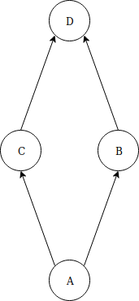

# soi-monitory
Symulacja urzędu przy użyciu 4 procesów oraz 4 kolejek. Implementacja oparta na wykorzystaniu wątków i monitorów.



Rys. 1. Schemat urzędu.


## Niezbędny plik **'monitor.h'** dostępny pod [linkiem](http://www.ia.pw.edu.pl/~tkruk/edu/soib/lab/monitor.h).

### Użycie
``` 
make
./main
```
